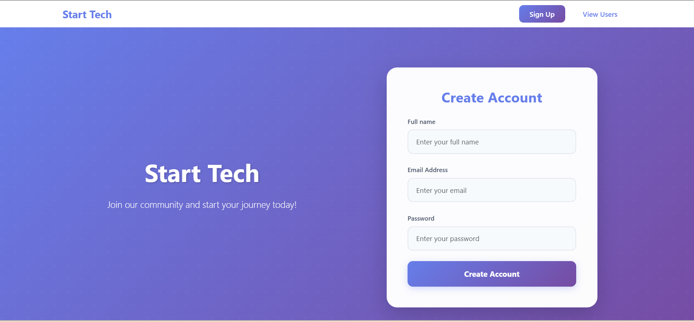
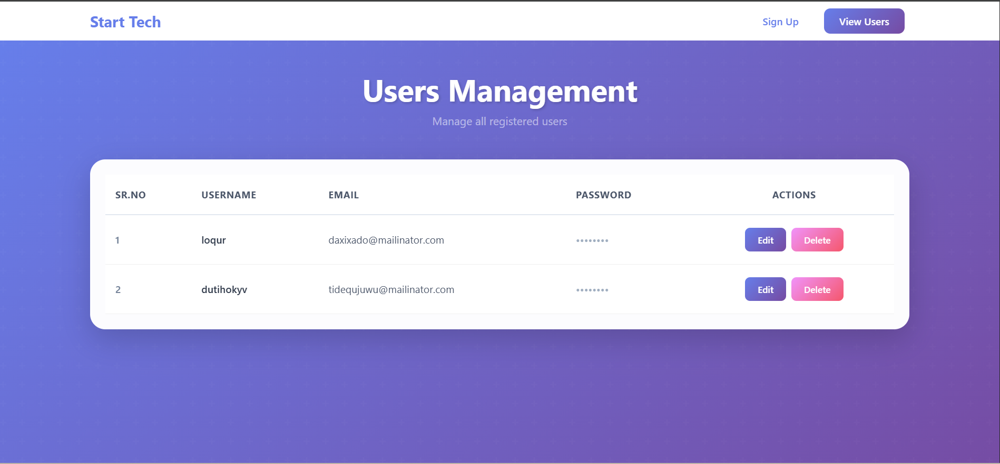
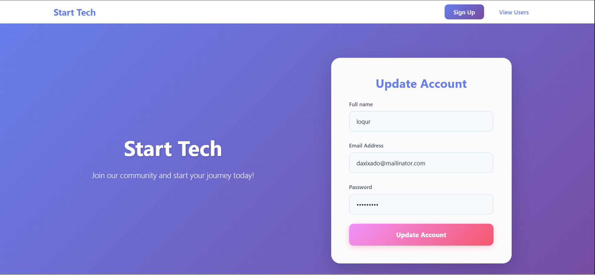

# 🧩 Redux Builder Project

A modern **React + Redux Toolkit** application built with **Vite** that demonstrates scalable state management, clean project architecture, and a professional UI workflow. This project is ideal for learning **Redux Toolkit**, **React Hooks**, and real-world frontend structure.

---

## 📌 Project Overview

This project focuses on:

* Centralized state management using **Redux Toolkit**
* Modular and reusable React components
* Clean folder structure following industry standards
* Fast development setup using **Vite**

It can be extended into real-world applications such as:

* Product Management Systems
* Cart / Order Management
* Admin Dashboards
* CRUD-based Applications

---

## 🚀 Tech Stack

| Technology            | Usage                         |
| --------------------- | ----------------------------- |
| **React.js**          | UI development                |
| **Redux Toolkit**     | Global state management       |
| **React Redux**       | React-Redux bindings          |
| **Vite**              | Fast development & build tool |
| **JavaScript (ES6+)** | Core programming language     |
| **CSS**               | Styling                       |
| **JSON Server**       | Mock backend (`db.json`)      |

---

## 📂 Project Structure

```bash
pr-10-redux-builder/
│
├── public/               # Static assets
├── src/
│   ├── app/              # Redux store configuration
│   ├── features/         # Redux slices
│   ├── components/       # Reusable UI components
│   ├── pages/            # Page-level components
│   ├── styles/           # Global & component styles
│   ├── App.jsx           # Root component
│   └── main.jsx          # App entry point
│
├── db.json               # Mock API data
├── index.html            # HTML template
├── package.json          # Dependencies & scripts
├── vite.config.js        # Vite configuration
└── README.md             # Project documentation
```

--

## ⚙️ Installation & Setup

### 1️⃣ Clone the Repository

```bash
git clone https://github.com/your-username/pr-10-redux-builder.git
```

### 2️⃣ Navigate to Project Folder

```bash
cd pr-10-redux-builder
```

### 3️⃣ Install Dependencies

```bash
npm install
```

### 4️⃣ Start Development Server

```bash
npm run dev
```

The app will run on:

```
http://localhost:5173
```

---

## 🛠️ Environment Requirements

Make sure you have the following installed:

* Node.js (v16 or later)
* npm or yarn
* Git
* Chrome (for Redux DevTools)

Optional:

* VS Code (Recommended)
* Redux DevTools Extension

---

## 🗄️ Redux Toolkit Flow (Interview Ready)

1. **Store Configuration** → `src/app/store.js`
2. **Slice Creation** → `createSlice()`
3. **Actions Export** → Auto-generated by slice
4. **Reducer Registration** → Store
5. **State Access** → `useSelector()`
6. **State Update** → `useDispatch()`

> 💡 Redux Toolkit reduces boilerplate and improves performance by default.

---

## 🎯 How This Project Uses Redux (Interview Explanation)

In this project, Redux Toolkit is used to manage global state in a scalable way.

### Flow:

* UI triggers an event (e.g., Add / Edit / Delete)
* `dispatch()` sends an action to the slice
* Reducer updates the state immutably
* Updated state is stored in the Redux Store
* UI automatically re-renders using `useSelector()`

### Why Redux Toolkit?

* Reduces boilerplate code
* Built-in immutability with Immer
* Better performance
* Industry standard for scalable React apps

---

## 🧪 Mock API (JSON Server)

The project uses `db.json` for mock backend data.

To start JSON Server:

```bash
npx json-server --watch db.json --port 3000
```

API Example:

```
http://localhost:3000/users
```

---

## 📸 Screenshots

> 📌 Add your project screenshots inside a `screenshots/` folder

```bash
screenshots/
├── home.png
├── redux-state.png
├── add-item.png
├── edit-item.png
```

### 🖼️ Sample Preview

| Home Page                 | Redux State                      |
| ------------------------- | -------------------------------- |
|  |  |

| View Item                      | Edit Item                      |
| ----------------------------- | ------------------------------ |
|  |  |

---

## ✅ Features

* ⚡ Fast Vite setup
* 🧠 Centralized state with Redux Toolkit
* ♻️ Reusable components
* 🧪 Mock backend with JSON Server
* 📦 Clean and scalable architecture
* 💼 Interview-ready project

---

## 🔮 Future Enhancements

* Authentication (Login / Register)
* Role-based access
* API integration
* Pagination & search
* Dark mode UI


---

## 🤝 Contributing

Contributions are welcome!

Steps:

1. Fork the repository
2. Create a new branch (`feature/new-feature`)
3. Commit your changes
4. Push to the branch
5. Create a Pull Request

---

## ⭐ Support

If you like this project, please consider giving it a ⭐ on GitHub.
It helps motivate continuous improvement and new features!

---

## 🙋‍♀️ Author

**Tisa Patel**
Frontend Developer (React.js)

---


